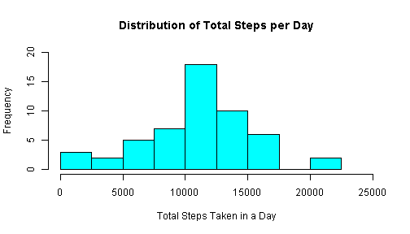
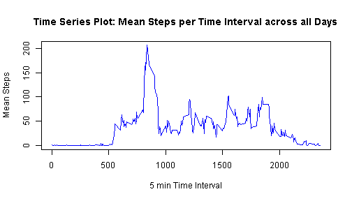
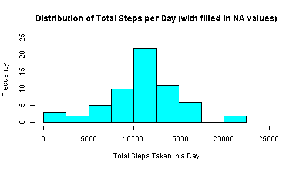
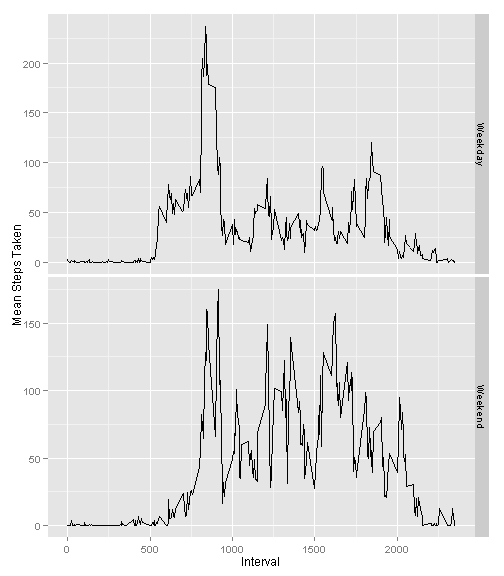

# Reproducible Research: Peer Assessment 1

The goal of this assignment is to explore the use of R markdown to combine R code, formatted markdown text, and graphs within a single file. Processing this R markdown document into a markdown document and an HTML document requires the R packages "markdown" and "knitr".

In this particular assignment, data from a step tracker is analyzed.

## The assignment dataset

Assignment data is stored in this repository as [activity.zip](https://github.com/AC-Novetta/RepData_PeerAssessment1/blob/master/activity.zip).

## Loading and preprocessing the data

Prior to loading the data, the zip file was downloaded, unzipped, and the resultant csv file was saved locally.

### Loading the dataset

The default loading parameters for the read.csv function are sufficient for this dataset.


```r
activityData <- read.csv("C:\\Andrea\\IBG_SupportingInfo\\Classes\\DataScience_Specialization\\ReproduceResearch\\PeerAssign_Data\\activity.csv")
```

### Preprocessing the dataset

No preprocessing was performed.

### Summarizing the dataset

The R code and text below summarizes the step tracker dataset characteristics.


```r
#Return Column Names from dataset
activityColNames <- names(activityData)

#Return the number of records in the dataset
acitivityRecCount <- nrow(activityData)

#Return the number of NA records per column in the dataset
steps.NARecs <- sum(is.na(activityData[,1]))
date.NARecs <- sum(is.na(activityData[,2]))
interval.NARecs <- sum(is.na(activityData[,3]))
```

The column names for the step tracker dataset are: **steps**, **date**, and **interval**. Where **steps** shows the total number of steps recorded by the step tracker on the day shown in **date** during the 5 min time frame shown in **interval**.

The number of records in the step tracker dataset is: **17568**.

The number of NA records per column in the step tracker dataset is:  
* steps: 2304
* date: 0
* interval: 0

## What is mean total number of steps taken per day?

To calculate the average(mean), average(median), and total number of steps recorded per day through the following R code, the R package "plyr" is required.

### Histogram of total steps per day

A histogram showing the distribution of the total number of steps recorded per day in the record set is shown below, using the following R code. Days where all values recorded for steps where NA are excluded from the histogram.


```r
library(plyr)

#Calculate the total, mean, and median of steps by date
stepsByDay <- ddply(activityData, "date", summarise, steps.RecordCount = sum(!is.na(steps)), steps.Total = sum(steps, na.rm = TRUE), steps.Mean = mean(steps, na.rm=TRUE), steps.Median = median(steps, na.rm=TRUE))

#Plot the frequency of total steps per day
hist(stepsByDay$steps.Total[!stepsByDay$steps.Total==0], breaks=seq(0,22500,by=2500), xlab="Total Steps Taken in a Day", main="Distribution of Total Steps per Day", col=461, xlim=c(0,25000), ylim=c(0,20))
```

 

### Calculated mean and median number of steps per day

The calculated values used in the histogram above, as well as the mean and median number of steps per day are shown below. In these results, the following data is shown for each date in the dataset:  
* **date** shows the day the results are calculated for
* **steps.recordCount** shows the number of non-NA records recorded on that day
* **steps.sum** shows the sum of all steps taken on that day
* **steps.mean** shows the mean number of steps taken that day, excluding NA values
* **steps.median** shows the median number of steps taken that day, excluding NA values


```r
#Return the number of days that only contain NA values
countMissingDays <- sum(is.na(stepsByDay[,5]))

#Return the number of days that do not only contain NA values
countPresentDays <- sum(!is.na(stepsByDay[,5]))

#Return the summary data calculated using ddply() in previous R code segment
stepsByDay
```

```
##          date steps.RecordCount steps.Total steps.Mean steps.Median
## 1  2012-10-01                 0           0        NaN           NA
## 2  2012-10-02               288         126     0.4375            0
## 3  2012-10-03               288       11352    39.4167            0
## 4  2012-10-04               288       12116    42.0694            0
## 5  2012-10-05               288       13294    46.1597            0
## 6  2012-10-06               288       15420    53.5417            0
## 7  2012-10-07               288       11015    38.2465            0
## 8  2012-10-08                 0           0        NaN           NA
## 9  2012-10-09               288       12811    44.4826            0
## 10 2012-10-10               288        9900    34.3750            0
## 11 2012-10-11               288       10304    35.7778            0
## 12 2012-10-12               288       17382    60.3542            0
## 13 2012-10-13               288       12426    43.1458            0
## 14 2012-10-14               288       15098    52.4236            0
## 15 2012-10-15               288       10139    35.2049            0
## 16 2012-10-16               288       15084    52.3750            0
## 17 2012-10-17               288       13452    46.7083            0
## 18 2012-10-18               288       10056    34.9167            0
## 19 2012-10-19               288       11829    41.0729            0
## 20 2012-10-20               288       10395    36.0938            0
## 21 2012-10-21               288        8821    30.6285            0
## 22 2012-10-22               288       13460    46.7361            0
## 23 2012-10-23               288        8918    30.9653            0
## 24 2012-10-24               288        8355    29.0104            0
## 25 2012-10-25               288        2492     8.6528            0
## 26 2012-10-26               288        6778    23.5347            0
## 27 2012-10-27               288       10119    35.1354            0
## 28 2012-10-28               288       11458    39.7847            0
## 29 2012-10-29               288        5018    17.4236            0
## 30 2012-10-30               288        9819    34.0938            0
## 31 2012-10-31               288       15414    53.5208            0
## 32 2012-11-01                 0           0        NaN           NA
## 33 2012-11-02               288       10600    36.8056            0
## 34 2012-11-03               288       10571    36.7049            0
## 35 2012-11-04                 0           0        NaN           NA
## 36 2012-11-05               288       10439    36.2465            0
## 37 2012-11-06               288        8334    28.9375            0
## 38 2012-11-07               288       12883    44.7326            0
## 39 2012-11-08               288        3219    11.1771            0
## 40 2012-11-09                 0           0        NaN           NA
## 41 2012-11-10                 0           0        NaN           NA
## 42 2012-11-11               288       12608    43.7778            0
## 43 2012-11-12               288       10765    37.3785            0
## 44 2012-11-13               288        7336    25.4722            0
## 45 2012-11-14                 0           0        NaN           NA
## 46 2012-11-15               288          41     0.1424            0
## 47 2012-11-16               288        5441    18.8924            0
## 48 2012-11-17               288       14339    49.7882            0
## 49 2012-11-18               288       15110    52.4653            0
## 50 2012-11-19               288        8841    30.6979            0
## 51 2012-11-20               288        4472    15.5278            0
## 52 2012-11-21               288       12787    44.3993            0
## 53 2012-11-22               288       20427    70.9271            0
## 54 2012-11-23               288       21194    73.5903            0
## 55 2012-11-24               288       14478    50.2708            0
## 56 2012-11-25               288       11834    41.0903            0
## 57 2012-11-26               288       11162    38.7569            0
## 58 2012-11-27               288       13646    47.3819            0
## 59 2012-11-28               288       10183    35.3576            0
## 60 2012-11-29               288        7047    24.4688            0
## 61 2012-11-30                 0           0        NaN           NA
```

As seen in the summary data 8 days in the dataset do not have any data recorded (rows showing NaN for steps.mean and NA for steps.median). These 8 days account for all 2304 NA records present in the dataset. The remaining 53 days in the dataset do not contain any NA values.

## What is the average daily activity pattern?

### Plotting the mean steps taken in each 5 minute interval across all days

The R code below calculates the mean steps per time interval across all days, excluding NA values, then plots the data as a time series


```r
#Calculate the total, mean, and median steps by interval, excluding all NA values
stepsByInterval <- ddply(activityData, "interval", summarise, steps.RecordCount = sum(!is.na(steps)), steps.Total = sum(steps, na.rm = TRUE), steps.Mean = mean(steps, na.rm=TRUE), steps.Median = median(steps, na.rm=TRUE))

#Create the subset of data as a time series
timeSeriesIntSteps <- ts()
timeSeriesIntSteps <- subset(stepsByInterval, select =c(interval, steps.Mean))

#Plot the data
plot(timeSeriesIntSteps, type="l", main="Time Series Plot: Mean Steps per Time Interval across all Days", ylab="Mean Steps", xlab="5 min Time Interval", col=100)
```

 

### Determining which 5 min interval has the largest average number of steps across all days

The R code below finds the maximum average step count (within any 5 min interval) and returns which 5 min interval contains that value.


```r
maxInt <- timeSeriesIntSteps[which.max(timeSeriesIntSteps[,2]),1]
```

The 5 minute interval with the largest mean number of steps across all days is: **835**.

## Imputing missing values

The total number of missing values in the dataset was previously calculated to be 2304. As previously stated, all of the missing (i.e. NA) data is exclusively confined to 8 days in the dataset. These 8 days have only NA values.


```r
#Previously calculated total missing (NA) values using: sum(is.na(activityData[,1]))
steps.NARecs
```

```
## [1] 2304
```

```r
#Previously calculated days containing only missing (NA) values using: sum(is.na(stepsByDay[,5]))
countMissingDays
```

```
## [1] 8
```

### Filing in the missing data

To fill in the missing (NA) data for the 8 days with only NA values, it was decided that the average steps taken within each 5 min interval for that day of the week would be used. To accomplish this, the original data was copied to a new data.frame and a new column was added defining the day of the week in each row. The R code for this is shown below.


```r
FillactivityData <- activityData
FillactivityData$day <- weekdays(as.Date(FillactivityData$date))
```

The average value for each 5 minute interval as a function of the day of the week (excluding NAs) was then calculated as shown in the R code below.


```r
stepsByIntervalDay <- ddply(FillactivityData, .(day,interval), summarise, steps.Mean = mean(steps, na.rm=TRUE))
```

Then, the 8 days with only NA values were updated to match the average number of steps taken across all other days by day of week and interval; as shown in the R code below.


```r
#Perform lookup and replace
naIndex <- which(is.na(FillactivityData))
for (i in 1:length(naIndex)) {
  d <- FillactivityData[naIndex[i],4]
  int <- FillactivityData[naIndex[i],3]
  tempData <- subset(stepsByIntervalDay, day==d & interval ==int, select=steps.Mean)
  FillactivityData[naIndex[i],1] <- tempData[1]
}

#Double check that no NA values are left, if this returns "0", then all NAs were replaced
sum(is.na(FillactivityData))
```

```
## [1] 0
```

All NAs were successfully replaced using this code.

### Reprint the histogram of total steps taken per day (with NA values filled in)


```r
library(plyr)

#Calculate the total, mean, and median of steps by date
FillstepsByDay <- ddply(FillactivityData, "date", summarise, steps.RecordCount = sum(!is.na(steps)), steps.Total = sum(steps, na.rm = TRUE), steps.Mean = mean(steps, na.rm=TRUE), steps.Median = median(steps, na.rm=TRUE))

#Plot the frequency of total steps per day
hist(FillstepsByDay$steps.Total, breaks=seq(0,22500,by=2500), xlab="Total Steps Taken in a Day", main="Distribution of Total Steps per Day (with filled in NA values)", col=461, xlim=c(0,25000), ylim=c(0,25))
```

 

This histogram shows that by replacing the NA values, a more days are tabulated with 7,500 - 10,000 and 10,000 - 12,500 steps. This is a result of the 8 days with only NA values now containing average (mean) total counts based on the day of week. In other words, by replicating average (mean) data into the missing days, the frequency of the central total step data increases.

### Calculated mean and median number of steps per day (with NA values filled in)

The calculated values used in the histogram above, as well as the mean and median number of steps per day are shown below. In these results, the following data is shown for each date in the dataset:  
* **date** shows the day the results are calculated for
* **steps.recordCount** shows the number of non-NA records recorded on that day
* **steps.sum** shows the sum of all steps taken on that day
* **steps.mean** shows the mean number of steps taken that day, excluding NA values
* **steps.median** shows the median number of steps taken that day, excluding NA values


```r
#Return the summary data calculated using ddply() in previous R code segment
FillstepsByDay
```

```
##          date steps.RecordCount steps.Total steps.Mean steps.Median
## 1  2012-10-01               288        9975    34.6349        8.214
## 2  2012-10-02               288         126     0.4375        0.000
## 3  2012-10-03               288       11352    39.4167        0.000
## 4  2012-10-04               288       12116    42.0694        0.000
## 5  2012-10-05               288       13294    46.1597        0.000
## 6  2012-10-06               288       15420    53.5417        0.000
## 7  2012-10-07               288       11015    38.2465        0.000
## 8  2012-10-08               288        9975    34.6349        8.214
## 9  2012-10-09               288       12811    44.4826        0.000
## 10 2012-10-10               288        9900    34.3750        0.000
## 11 2012-10-11               288       10304    35.7778        0.000
## 12 2012-10-12               288       17382    60.3542        0.000
## 13 2012-10-13               288       12426    43.1458        0.000
## 14 2012-10-14               288       15098    52.4236        0.000
## 15 2012-10-15               288       10139    35.2049        0.000
## 16 2012-10-16               288       15084    52.3750        0.000
## 17 2012-10-17               288       13452    46.7083        0.000
## 18 2012-10-18               288       10056    34.9167        0.000
## 19 2012-10-19               288       11829    41.0729        0.000
## 20 2012-10-20               288       10395    36.0938        0.000
## 21 2012-10-21               288        8821    30.6285        0.000
## 22 2012-10-22               288       13460    46.7361        0.000
## 23 2012-10-23               288        8918    30.9653        0.000
## 24 2012-10-24               288        8355    29.0104        0.000
## 25 2012-10-25               288        2492     8.6528        0.000
## 26 2012-10-26               288        6778    23.5347        0.000
## 27 2012-10-27               288       10119    35.1354        0.000
## 28 2012-10-28               288       11458    39.7847        0.000
## 29 2012-10-29               288        5018    17.4236        0.000
## 30 2012-10-30               288        9819    34.0938        0.000
## 31 2012-10-31               288       15414    53.5208        0.000
## 32 2012-11-01               288        8213    28.5165        7.750
## 33 2012-11-02               288       10600    36.8056        0.000
## 34 2012-11-03               288       10571    36.7049        0.000
## 35 2012-11-04               288       12278    42.6310       23.857
## 36 2012-11-05               288       10439    36.2465        0.000
## 37 2012-11-06               288        8334    28.9375        0.000
## 38 2012-11-07               288       12883    44.7326        0.000
## 39 2012-11-08               288        3219    11.1771        0.000
## 40 2012-11-09               288       12360    42.9157       15.500
## 41 2012-11-10               288       12535    43.5258       16.429
## 42 2012-11-11               288       12608    43.7778        0.000
## 43 2012-11-12               288       10765    37.3785        0.000
## 44 2012-11-13               288        7336    25.4722        0.000
## 45 2012-11-14               288       11791    40.9401       12.625
## 46 2012-11-15               288          41     0.1424        0.000
## 47 2012-11-16               288        5441    18.8924        0.000
## 48 2012-11-17               288       14339    49.7882        0.000
## 49 2012-11-18               288       15110    52.4653        0.000
## 50 2012-11-19               288        8841    30.6979        0.000
## 51 2012-11-20               288        4472    15.5278        0.000
## 52 2012-11-21               288       12787    44.3993        0.000
## 53 2012-11-22               288       20427    70.9271        0.000
## 54 2012-11-23               288       21194    73.5903        0.000
## 55 2012-11-24               288       14478    50.2708        0.000
## 56 2012-11-25               288       11834    41.0903        0.000
## 57 2012-11-26               288       11162    38.7569        0.000
## 58 2012-11-27               288       13646    47.3819        0.000
## 59 2012-11-28               288       10183    35.3576        0.000
## 60 2012-11-29               288        7047    24.4688        0.000
## 61 2012-11-30               288       12360    42.9157       15.500
```

The main difference between the mean and median data for the NA filled in dataset versus the orginal data is that the filled in data contains a non-zero median value. All original data contained a zero (or NA) median value, meaning that within the original data on any given day, >50% of time intervals did not include any steps. The NA filled data artificially removes these zero steps time intervals from the filled in days, as the mean was used to fill in data. 

## Are there differences in activity patterns between weekdays and weekends?

To determine the difference between Weekdays and Weekends, a new column was added to the NA filled in dataset to distiguish between the two classes.

Note: Mon through Fri are considered Weekdays; whereas Sat and Sun are considered Weekends.


```r
##Add new column to distinguish between Weekday vs. Weekend; start with TRUE/FALSE then replace with "Weekend" and "Weekday"
FillactivityData$classify <- FillactivityData$day %in% c("Sunday","Saturday")
for (i in 1:nrow(FillactivityData)) {
  if (FillactivityData[i,5]==TRUE){
    FillactivityData[i,5] <- "Weekend"
  }
  else {FillactivityData[i,5] <- "Weekday"}
}

##Calculate the new averages based on classes
stepsByIntervalClass <- ddply(FillactivityData, .(interval,classify), summarise, steps.Mean = mean(steps, na.rm=TRUE))
```

### Mean Steps Taken per Time Interval, Averaged across all Days (NA values filled in): Graphically comparing Weekdays to Weekends

The plot below shows the graphical comparison. To plot the differeneces in two graphs as a times series, the R packages "ggplot2" and "reshape2" were used.


```r
##Plot the data into 2, stacked graphs based on the classification Weekday vs Weekend
library(ggplot2)
library(reshape2)

ggplot (stepsByIntervalClass, aes(x=interval, y=steps.Mean)) +
  geom_line() + 
  facet_grid(classify ~ ., scales = "free") +
  ylab("Mean Steps Taken") +
  xlab("Interval")
```

 
